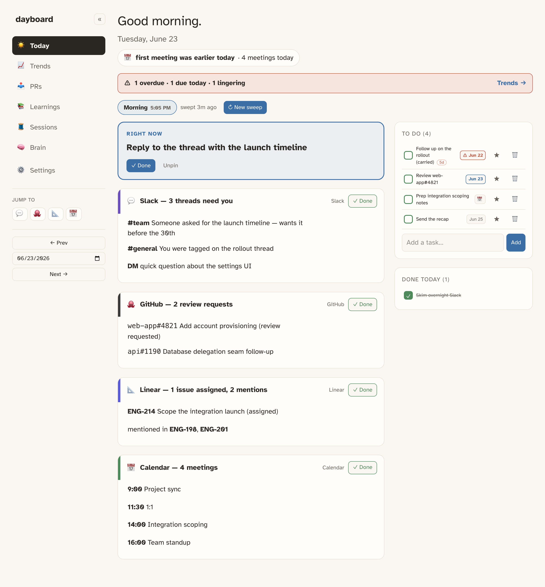
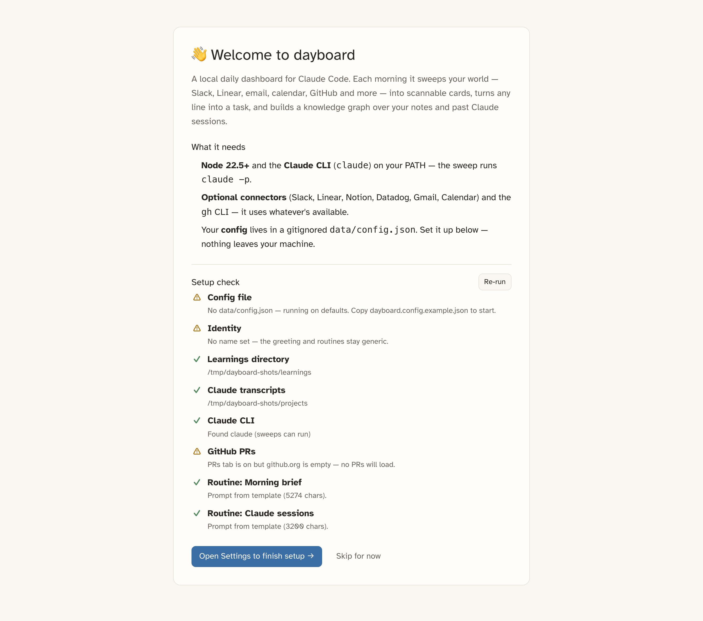
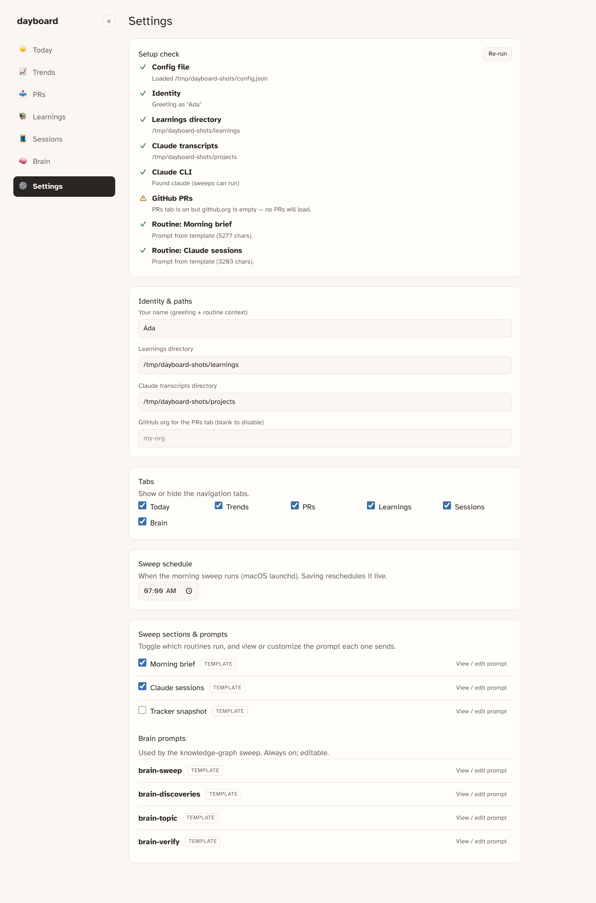

<h1 align="center">dayboard</h1>

<p align="center">
  <b>A local, always-on daily dashboard for Claude Code.</b><br>
  Every morning it sweeps your world into clear, scannable cards — then helps you act on them.
</p>

<p align="center">
  
</p>

A headless `claude -p` sweep pulls Slack, Linear, Notion, Datadog, email, calendar, and
GitHub into one place each morning. Turn any line into a task; incomplete tasks carry across
days; everything is kept as history. A 🧠 **Brain** tab builds a knowledge graph over your
notes and past Claude Code sessions and surfaces cross-document discoveries.

Everything runs **on your machine** — your data never leaves it. Anything personal or
org-specific lives in a gitignored `data/config.json`, so the app ships generic and you
configure it, rather than edit code.

Built with care for ADHD/dyslexia: a calm warm-paper palette, dyslexia-friendly type,
shape + color + label redundancy (never color alone), and a single-focus "current task."

## Highlights

- ☀️ **Morning brief** — your connectors, swept into scannable cards. Each card line can
  become a task in one click.
- ✅ **Tasks that persist** — a pinned "current task," a backlog that carries across days,
  due dates, and a lingering-work nudge.
- 🧠 **Brain** — an interactive knowledge graph of your learnings + Claude sessions, with
  AI-synthesized discoveries. Cmd-click two topics and **Surface overlap** to see how they
  connect.
- 📥 **PRs / 🧵 Sessions / 📈 Trends** — your open PRs, your local Claude Code sessions
  (filter out the agent/sweep noise), and usage trends.
- ⚙️ **Admin panel** — toggle tabs and routines, view and edit every sweep prompt, run a
  setup check, and reschedule the morning sweep — all in-app.
- 🔌 **Config-driven** — point it at your own connectors, paths, and routines. No code edits.

## Quickstart

```bash
git clone https://github.com/jah2488/dayboard.git && cd dayboard
npm install
cp dayboard.config.example.json data/config.json   # your local config (gitignored)
# edit data/config.json: set identity.name, paths, github.org (optional) — see Configuration
npm run build
npm start                                           # http://localhost:4747
```

On first launch (no config yet) dayboard greets you with a guided setup + live checks:

<p align="center">
  
</p>

Open **⚙ Settings → Setup check** any time to confirm your paths, the `claude` binary, and
connectors are wired. Hit **↻ New sweep** on Today to run your first sweep on demand.

For hot-reload development: `npm run dev` (Vite UI on `:5173`, API on `:4747`).

### Requirements

- **Node 22.5+** (uses the built-in `node:sqlite` — no native build step).
- **Claude Code CLI** (`claude`) installed and authenticated — the sweep runs `claude -p`.
- **Optional:** the `gh` CLI (PRs tab + GitHub in the brief) and whatever MCP connectors you
  want (Slack, Linear, Notion, Datadog, Gmail, Calendar). The sweep uses what's available
  and notes what's missing — nothing is required.

## Configuration

Nothing personal is hard-coded. Your real values live in **`data/config.json`** (gitignored);
the repo ships **`dayboard.config.example.json`** as the template. Edit the file, or — easier —
use the **⚙ Settings** tab:

<p align="center">
  
</p>

| Key | What it does |
| --- | --- |
| `identity.name` | Greeting + how routines refer to you (blank = generic). |
| `paths.learningsDir` / `claudeProjectsDir` | Your notes and Claude Code transcripts (Brain + Sessions sources). |
| `schedule` | When the morning sweep runs (drives the launchd agent). |
| `models` | `tag` (cheap tier, indexing) and `reason` (mid tier, the brief). |
| `github.org` + `repoChannels` / `repoKeywordRules` | PRs-tab scope and repo→review-channel routing (blank org disables PRs). |
| `tabs` | Show/hide each navigation tab. |
| `routines` | Which sweep routines run, in order. |
| `connectors` | Connectors you expect the sweep to use (drives the setup check). |

### Feeding the Learnings tab & Brain

Heads-up: **dayboard only *reads* your learnings directory — it never writes to it.**
The Learnings tab and the Brain's learnings half stay empty until *you* put markdown notes
there. (Your Claude Code **sessions** are different — they're created automatically just by
using Claude Code, so the Sessions tab and the Brain's session half populate on their own.)

The recommended way to fill it is to have Claude save research notes there as you work. Add
something like this to your global `~/.claude/CLAUDE.md`:

```
When asked to produce notes, takeaways, investigation reports, or other documents I'll
revisit later, write them to ~/Projects/learnings/YYYY-MM-DD-{kebab-slug}.md
(matching paths.learningsDir in dayboard's config).
```

Or just drop `.md` files in the directory yourself. The setup check (⚙ Settings) reports how
many docs it finds, so you'll know if it's empty.

### Sweep prompts

A **routine** is a prompt run during the sweep; its markdown output is split into cards by
`##` headings. The shipped prompts are generic templates in `routines/` using
`{{identity.name}}`-style placeholders. To customize one, open **Settings → Sweep prompts**,
edit it, and save — that writes a gitignored override to `data/routines/<name>.md` that wins
over the template. Clear it to revert. This is how you make dayboard yours without touching
the public repo.

## Always-on + morning sweep (macOS)

```bash
npm run build
scripts/install-launchd.sh          # server (KeepAlive) + morning sweep
MORNING_HOUR=8 MORNING_MIN=30 scripts/install-launchd.sh   # custom time
bin/morning-run.sh                  # run a morning sweep by hand
```

The morning agent POSTs `/api/sweep`; the always-on server does the `claude -p` sweep, so
the machine must be awake at the scheduled time. Logs: `~/Library/Logs/dayboard/`. Full
runbook: [`ACTIVATION.md`](ACTIVATION.md).

## Claude hooks (MCP)

dayboard ships an MCP server (`server/mcp.ts`) so Claude can read and act on the board —
`get_day`, `list_tasks`, `create_task`, `complete_task`, `trigger_sweep`, `search_brain`,
`trigger_brain_sweep`, and more. Register it via [`ACTIVATION.md`](ACTIVATION.md). A
`state/today.json` snapshot also refreshes on every change for direct file reads.

## Brain (knowledge graph)

A daily AI sweep turns your learnings and local Claude Code sessions into a topic/link
graph, rendered as an interactive mindmap, plus cross-document **discoveries** (trends,
threads, patterns, fixes, and the cross-cutting correlation / contradiction / silence kinds)
synthesized from the whole graph and then verified against your connectors. Files under
`data/brain/` are the source of truth — no DB tables. Cmd/Ctrl-click two topics and
**Surface overlap** to synthesize just their connection. Tunable prompts live in `routines/`.

## Stack

- **Server:** Node 22.5+, [Hono](https://hono.dev) — serves the UI + `/api` + `/mcp`.
- **DB:** built-in `node:sqlite`, plain-SQL migrations in `db/migrations/`.
- **UI:** Vite + React + TypeScript, Tailwind v4.

## Layout

```
server/   Hono server, SQLite, sweep, brain, MCP
src/      React UI
shared/   types shared by server + UI
routines/ generic prompt templates ({{placeholder}}-driven)
db/       SQL migrations
data/     config.json, routine overrides, SQLite db, brain graph (ALL gitignored)
```

## License

MIT — see [LICENSE](LICENSE).
